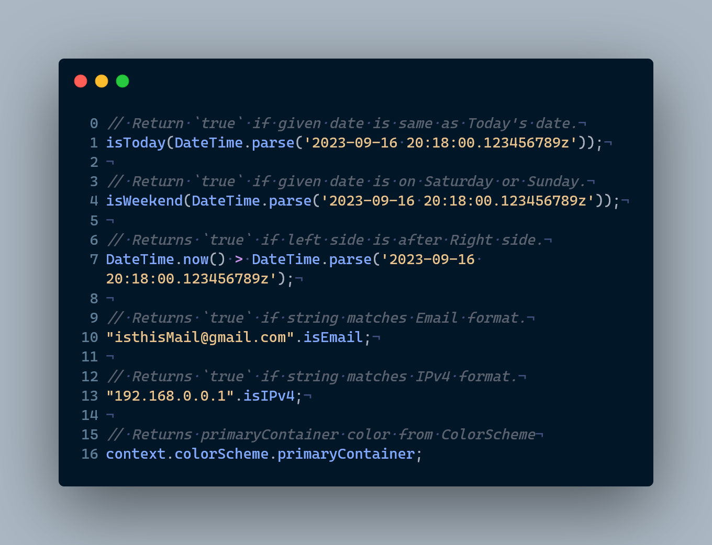

# extension_ksama



Collection of must have extensions on DateTime, String, BuildContext and many more.

<p align="center">
  <a href="#getting-started">Getting Started</a> •
  <a href="#list-of-extensions">Extensions</a>
</p>

## Getting started

Import

```dart
import 'package:extension/_ksamaextension_ksama.dart';
``` 

## List of Extensions

<ul>
  <a href="#extensions-on-datetime">DateTime</a><br/>
  <a href="#extensions-on-string">String</a><br/>
  <a href="#extensions-on-buildcontext">BuildContext</a><br/>
</ul>

Currently we have following extensions getters, operators and methods.

#### **Extensions on DateTime:**
    - Operations
      - DateTime superAdd({
          int days = 0,
          int weeks = 0,
          int months = 0,
          int years = 0,
        })
      - DateTime superSubtract({
          int days = 0,
          int weeks = 0,
          int months = 0,
          int years = 0,
        })
      - DateTime get nextDay
      - DateTime get prevDay
      - DateTime get firstDayOfMonth
      - DateTime get lastDayOfMonth
      - DateTime get nextMonth
      - DateTime get prevMonth
      - DateTime get firstDayOfWeek
      - DateTime get lastDayOfWeek
      - DateTime get nextWeek
      - DateTime get prevWeek
      - DateTime get firstDayOfYear
      - DateTime get lastDayOfYear
      - DateTime get nextYear
      - DateTime get prevYear
    - Checkers
      - bool get isToday
      - bool get isTomorrow
      - bool get isYesterday
      - bool get isWeekend
      - bool get isWeekday
    - Comparators
      - bool operator >(DateTime otherDate)
      - bool operator >=(DateTime otherDate)
      - bool operator <(DateTime otherDate)
      - bool operator <=(DateTime otherDate)
    - Manipulators
      - DateTime get onlyDate
      - DateTime get removeMicros
      - DateTime get removeMillis
      - DateTime get removeSeconds
      - DateTime get removeMinutes

#### **Extensions on String:**
    - Cases
      - String get capitalisation
      - String get titleCase
      - String get pascalCase
      - String get camelCase
      - String get toggleCase
    - Manipulators
      - String get reverse
      - List<String> get tokenise
      - String get abbreviate
    - Converters
      - int? toInt({int? base})
      - double? toDouble()
      - bool? toBool()
    - Validators
      - bool get isEmail
      - bool get isISBN
      - bool get isIPv4
      - bool get isIPv6
    - Checkers
      - bool get isBlanksOnly
      - bool get isDecimal
      - bool get isBinary
      - bool get isOctal
      - bool get isHexadecimal
      - bool get isDouble
      - bool get isBool

#### **Extensions on BuildContext:**
    - ThemeData get theme
    - ColorScheme get colorScheme
    - TextTheme get textTheme
